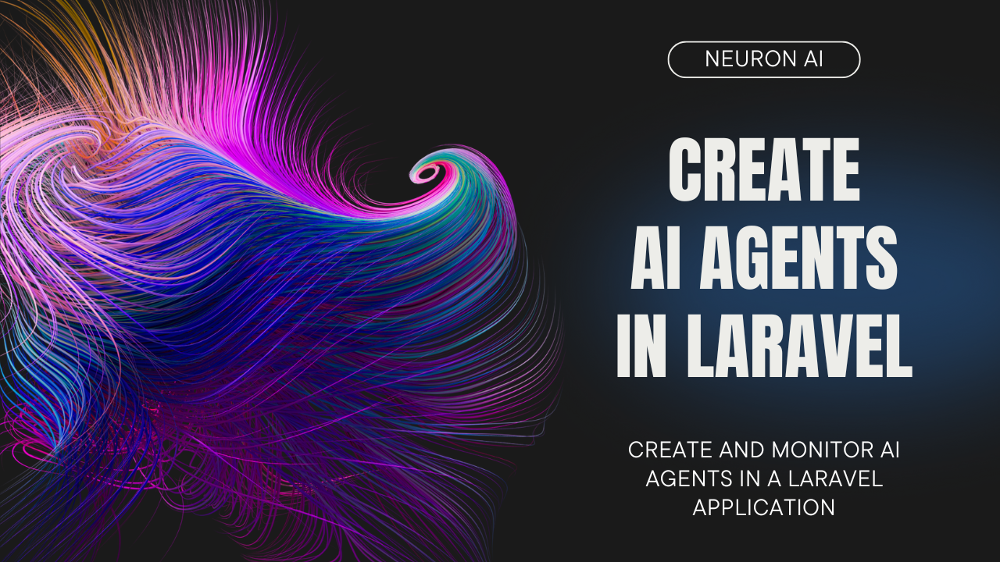

# Neuron AI Laravel SDK

> [!IMPORTANT]
> Get early access to new features, exclusive tutorials, and expert tips for building AI agents in PHP. Join a community of PHP developers pioneering the future of AI development.
> [Subscribe to the newsletter](https://neuron-ai.dev)

> In this package we provide you with a development kit specifically designed for Laravel integration points without limiting the access to the Neuron native API. You can also use this package as an inspiration to design your own custom integration pattern.

This package aims to make it easier for Laravel developers to get started with AI agent development using Neuron AI framework. 
Neuron doesn't need invasive abstractions, it already has a very simple syntax, 100% typed code, and clear interfaces you can rely on to 
develop your agentic system or create custom plugins and extensions. 

You can find a ready-to-use configuration file, a few artisan commands to reduce boilerplate code, 
a service class to get an instance of the AI provider with the classic Laravel configuration-driven approach.
You can also find ready-to-run migration if you want to use the Eloquent Chat History component, 
and other useful helpers.

## What is Neuron?

Neuron is the leading PHP framework for creating and orchestrating AI Agents. It allows you to integrate AI entities in your
PHP applications with a powerful and flexible architecture. We provide tools for the entire agentic application development lifecycle,
from LLM interfaces, data loading, to multi-agent orchestration, monitoring and debugging.
In addition, we provide tutorials and other educational content to help you get started using AI Agents in your projects.

[**Laravel Tutorial**](https://www.youtube.com/watch?v=oSA1bP_j41w)

[](https://www.youtube.com/watch?v=oSA1bP_j41w)

<a name="requirements"></a>

## Requirements

- PHP >= 8.2
- Laravel >= 10.x

<a name="install"></a>

## Install

Install the latest version by:

```
composer require neuron-core/neuron-laravel
```

<a name="configuration"></a>

## Configuration file

If you want to customize the configuration file beyond the environment variables, you can copy the package configuration file
in your project `config/neuron.php` folder:

```
php artisan vendor:publish --tag=neuron-config
```

<a name="agent"></a>

## Create an Agent

To create a new AI agent, run the following command:

```
php artisan neuron:agent MyAgent
```

This will create a new agent class in your `app/Neuron/Agents` folder with the name `MyAgent.php` and a couple of 
basic methods inside.

<a name="commands"></a>

### Available Artisan Commands

The package ships with a few artisan commands to reduce boilerplate code and make the setup process easier for the most common
Neuron AI components.

```
# Create an agent
php artisan neuron:agent MyAgent

# Create a RAG
php artisan neuron:rag MyRAG

# Create a tool
php artisan neuron:tool MyTool

# Create a workflow
php artisan neuron:workflow MyWorkflow

# Create a node
php artisan neuron:node CustomNode

# Create a middleware
php artisan neuron:middleware CustomMiddleware
```

<a name="providers"></a>

## AI Providers

Neuron allows you to implement AI agents using many different providers, like Anthropic, Gemini, OpenAI, Ollama, Mistral, and many more.
Learn more about supported providers in the Neuron AI documentation: **https://docs.neuron-ai.dev/the-basics/ai-provider** 

To get an instance of the AI Provider you want to attach to your agent, you can use the `NeuronAI\Laravel\Facades\AIProvider` facade.

```php
namespace App\Neuron;

use NeuronAI\Agent;
use NeuronAI\SystemPrompt;
use NeuronAI\Laravel\Facades\AIProvider;
use NeuronAI\Providers\AIProviderInterface;

class YouTubeAgent extends Agent
{
    protected function provider(): AIProviderInterface
    {
        // return an instance of Anthropic, OpenAI, Gemini, Ollama, etc...
        return AIProvider::driver('anthropic');
    }
    
    public function instructions(): string
    {
        return (string) new SystemPrompt(...config('neuron.system_prompt');
    }
}
```

You can see all the available providers in the documentation: **https://docs.neuron-ai.dev/the-basics/ai-provider**

You can configure the appropriate API key in your environment file:

```dotenv
# Support for: anthropic, gemini, openai, openai-responses, mistral, ollama, huggingface, deepseek
NEURON_AI_PROVIDER=anthropic

ANTHROPIC_KEY=
ANTHROPIC_MODEL=

GEMINI_KEY=
GEMINI_MODEL=

OPENAI_KEY=
OPENAI_MODEL=

MISTRAL_KEY=
MISTRAL_MODEL=

OLLAMA_URL=
OLLAMA_MODEL=

# And many others
```

<a name="providers"></a>

## RAG (embeddings & vector stores)

If you want to implement a RAG kind of system, the configuration file also allows you to configure the embedding provider 
and vector store you want to use in your RAG agents, and the connection parameters (API key, model, etc.).

Here is an example of how to configure the embedding provider and vector store in the RAG component:

```php
namespace App\Neuron;

use NeuronAI\Laravel\Facades\AIProvider;
use NeuronAI\Laravel\Facades\EmbeddingProvider;
use NeuronAI\Laravel\Facades\VectorStore;
use NeuronAI\Providers\AIProviderInterface;
use NeuronAI\RAG\Embeddings\EmbeddingsProviderInterface;
use NeuronAI\RAG\RAG;
use NeuronAI\RAG\VectorStore\VectorStoreInterface;

class MyChatBot extends RAG
{
    protected function provider(): AIProviderInterface
    {
        return AIProvider::driver('anthropic');
    }
    
    protected function embeddings(): EmbeddingsProviderInterface
    {
        return EmbeddingProvider::driver('openai');
    }
    
    protected function vectorStore(): VectorStoreInterface
    {
        return VectorStore::driver('file');
    }
}
```

You can go to the Neuron AI documentation to learn more about RAG and its available configuration options:
https://docs.neuron-ai.dev/rag/rag

<a name="migrations"></a>

## EloquentChatHistory

Neuron provides you with a built-in system to manage the memory of a chat session you perform with the agent.
In many Q&A applications you can have a back-and-forth conversation with the LLM, meaning the application needs some sort 
of "memory" of past questions and answers, and some logic for incorporating those into its current thinking.

Here is the documentation: **https://docs.neuron-ai.dev/the-basics/chat-history-and-memory**

The package ships with a ready-to-use migration for the `ElquentChatHistory` component. Here is the command to copy the migration
in your project `database/migrations/neuron` folder:

```
php artisan vendor:publish --tag=neuron-migrations
```

And then run the migrations:

```
php artisan migrate --path=/database/migrations/neuron
```

Read more about **Eloquent Chat History** in the Neuron AI documentation: **https://docs.neuron-ai.dev/the-basics/chat-history-and-memory#eloquentchathisotry**
